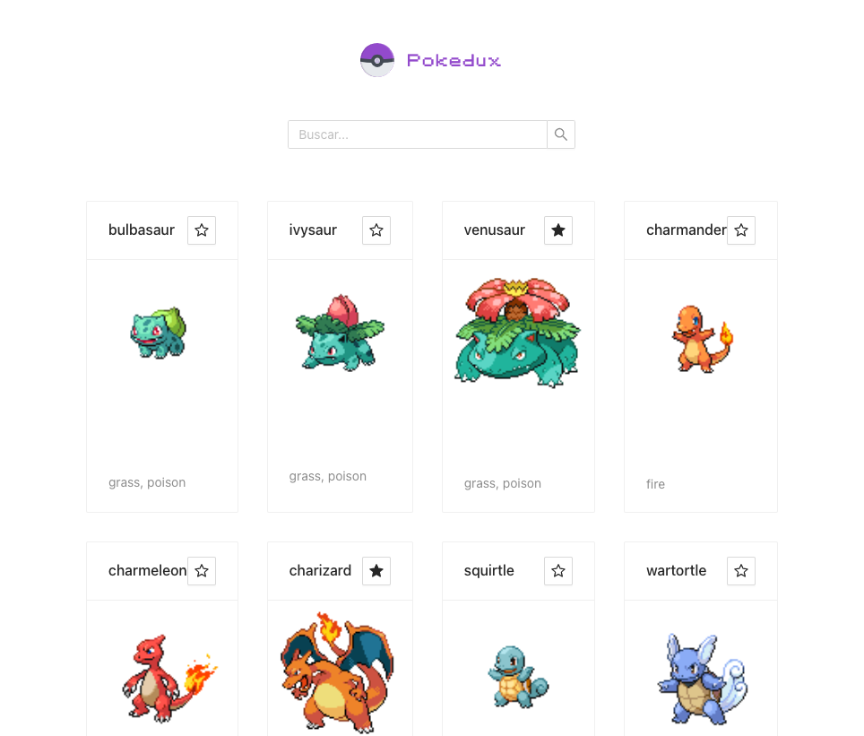

# Pokedux

This project was bootstrapped with [Create React App](https://github.com/facebook/create-react-app).

## Technologies

- React UI Framework: [Ant Design](https://ant.design/)

NON-functional design:

- Search input
- List of Pokemon Cards.

---

### Available Scripts

In the project directory, you can run:

#### `npm start`

Runs the app in the development mode.\
Open [http://localhost:3000](http://localhost:3000) to view it in your browser.

#### `npm run build`

Builds the app for production to the `build` folder.\

### Preview

